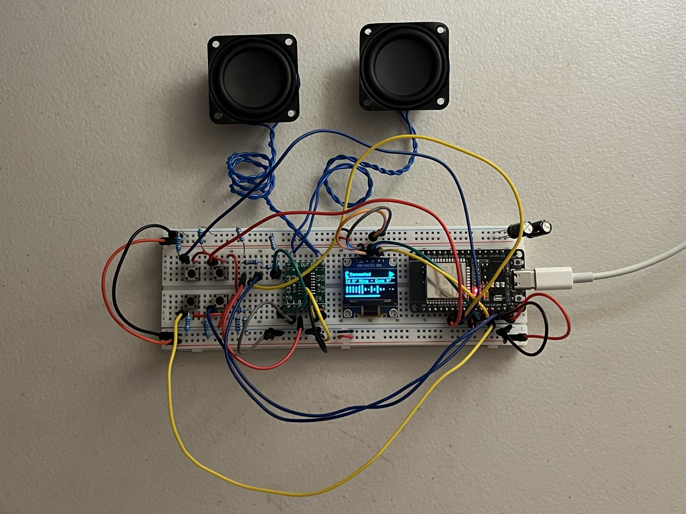
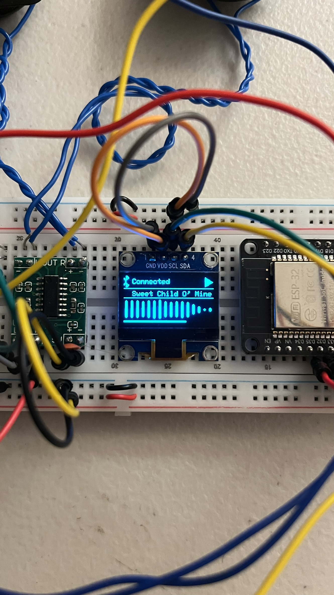

# ESP32 Bluetooth Speaker with FFT Spectrum Analyser

An ESP32-based Bluetooth speaker with an OLED status/FFT display and a custom amp stage.

## Overview

The ESP32 receives audio over Bluetooth (A2DP) and outputs it through its internal DAC into a resistor-divider stage and a PAM8403 class-D amplifier driving two speakers. An SSD1306 OLED shows connection state, playback status, scrolling track metadata, a live 16-band FFT spectrum of the audio, and a volume bar. Four pushbuttons handle volume, play/pause, and (eventually) source switching between Bluetooth and a planned AM radio front-end.



Full build — ESP32 and PAM8403 amp module on the breadboard, buttons and resistor dividers wired in, both 5W speakers mounted above, powered via USB-C.



OLED close-up — Bluetooth connected, current track scrolling, and the live 16-band FFT spectrum driven off the audio stream.

A demo video of the build in action (audio + live FFT display) is included in the repo as `btspeakervid.mp4`.

## Hardware

| Part | Notes |
|---|---|
| ESP32 dev board | Left-column pins only; not seated in breadboard, connected via jumpers |
| SSD1306 OLED | 128x64, I2C |
| PAM8403 module | Pre-built (onboard passives already present) |
| Speaker x2 | 5W/4Ω each |
| 4x pushbuttons | Pull-down config |
| Bulk cap | 940µF electrolytic, VIN/GND |
| Resistor divider x2 | 10kΩ+10kΩ, one per channel, between DAC pin and amp input (prevents clipping + prevents floating input) |

## Pin assignments

| Function | GPIO |
|---|---|
| I2C SDA (OLED) | 14 |
| I2C SCL (OLED) | 27 |
| DAC Left | 25 |
| DAC Right | 26 |
| Volume up | 32 |
| Volume down | 33 |
| Play/pause | 12 |
| Mode (BT/AM, unimplemented) | 13 |

Buttons: one leg → GPIO, other leg → external 10kΩ pull-down → GND, and → onboard **3.3V** pin (not VIN).

## Wiring notes

- DAC → divider (10k+10k, midpoint → amp input) → PAM8403 L/R input pads
- PAM8403 GND/PGND, ESP32 GND, all button pull-downs → one shared ground rail
- Amp outputs are BTL (differential) — neither − terminal is ground; each speaker only connects to its own matched +/− pair

## Firmware

Built on `BluetoothA2DPSink` (A2DP + AVRCP) with `AnalogAudioStream` output (internal DAC).

Features:
- Connection-state, play-status, and track-metadata callbacks driving the OLED display
- Debounced buttons — volume and play/pause are functional; mode is wired but a no-op pending the AM switch hardware
- Custom OLED graphics: BT glyph bitmap, scrolling title + artist, 16-band FFT spectrum (via `arduinoFFT` and `set_stream_reader()`), and a volume bar

### Libraries

- `ESP32-A2DP` + `arduino-audio-tools` (both pschatzmann — manual ZIP install, not available via Library Manager)
- `Adafruit SSD1306`
- `Adafruit GFX Library`
- `arduinoFFT` (kosme)

## FFT spectrum analyser

The 16-band display is the most involved part of the firmware. It runs in three stages: capture, transform, and banding.

**1. Capturing samples without blocking audio**

`set_stream_reader()` hands the raw Bluetooth PCM stream to `read_data_stream()`, which runs on the Bluetooth stack's own task — not `loop()` — alongside normal playback. It has to be fast and non-blocking, or it'll stall audio. It just strides through the interleaved stereo stream, grabs the left channel, and fills a ring buffer:

```cpp
volatile bool fftBufferReady = false;
int fftWriteIndex = 0;
int16_t fftCaptureBuffer[FFT_SAMPLES];

void read_data_stream(const uint8_t *data, uint32_t length) {
  if (fftBufferReady) return; // loop() hasn't consumed the last buffer yet — skip this packet
  int16_t *samples = (int16_t *)data;
  uint32_t sampleCount = length / 2; // 16-bit samples
  for (uint32_t i = 0; i < sampleCount && !fftBufferReady; i += 2) {
    fftCaptureBuffer[fftWriteIndex++] = samples[i];
    if (fftWriteIndex >= FFT_SAMPLES) {
      fftWriteIndex = 0;
      fftBufferReady = true;
    }
  }
}
```

Two tasks (the Bluetooth stack and `loop()`) share `fftCaptureBuffer` without a mutex. That's safe here specifically because the `fftBufferReady` flag enforces strict turn-taking: the writer stops the instant the buffer fills, and only starts again once the reader clears the flag. A real mutex would be overkill (and riskier, since blocking the BT task risks audio glitches) for a producer/consumer pair that never touches the buffer at the same time.

**2. Turning samples into a spectrum**

Once a buffer's ready, `loop()` removes the DC bias (subtracts the mean, so a nonzero average sample doesn't show up as a fake low-frequency spike), applies a Hamming window (tapers the block's edges so the FFT doesn't misread the sudden cutoff as extra frequency content), then runs `arduinoFFT`:

```cpp
double mean = 0;
for (int i = 0; i < FFT_SAMPLES; i++) mean += fftCaptureBuffer[i];
mean /= FFT_SAMPLES;
for (int i = 0; i < FFT_SAMPLES; i++) {
  vReal[i] = (double)fftCaptureBuffer[i] - mean;
  vImag[i] = 0.0;
}
fftBufferReady = false; // release the buffer back to the audio callback

FFT.windowing(FFTWindow::Hamming, FFTDirection::Forward);
FFT.compute(FFTDirection::Forward);
FFT.complexToMagnitude();
```

With 256 samples at a 44.1kHz sample rate, this produces 128 usable frequency bins spaced linearly from 0Hz to ~22kHz.

**3. Bins to bars: log-spaced bands with self-calibrating range**

128 linear bins don't map well onto 16 bars — most bins fall in the treble, and bass gets squeezed into one or two. `computeBands()` groups bins logarithmically instead, so each bar spans roughly one octave, matching how pitch is actually perceived:

```cpp
int startBin = minBin + (int)pow((float)usableBins, (float)band / NUM_BANDS);
int endBin   = minBin + (int)pow((float)usableBins, (float)(band + 1) / NUM_BANDS);
```

Each band also tracks its own recent loudest/quietest level in dB, snapping instantly to a new extreme and relaxing back slowly otherwise:

```cpp
if (db > bandCeilDb[band]) {
  bandCeilDb[band] = db;             // new loudest moment: snap up now
} else {
  bandCeilDb[band] -= RANGE_RELEASE; // otherwise ease back down
}
if (db < bandFloorDb[band]) {
  bandFloorDb[band] = db;            // new quietest moment: snap down now
} else {
  bandFloorDb[band] += RANGE_RELEASE; // otherwise ease back up
}
```

The current reading is then normalised into that floor→ceiling window. This is what makes quiet songs still show visible bar movement instead of flatlining, and loud songs not just peg every bar at max — the scale continuously adapts to whatever's actually playing, rather than using one fixed dB range for all music.

## Future improvements

Things I'd add if I kept working on this:

- Swap the internal 8-bit DAC for an external I2S DAC (e.g. PCM5102), for cleaner audio and to free up GPIO26 from being DAC-locked
- Finish the AM radio front end — a hand-wound ferrite loopstick, variable capacitor, and 1N34A germanium diode feeding into the PAM8403 — as the second source
- Add proper switching hardware (analog switch IC or relay) so the mode button can actually flip between Bluetooth and AM
- Move the AM section onto its own breadboard, since RF pickup is sensitive to noise from the ESP32 and amp
- Move off USB-C power onto a dedicated 5V rail so the amp isn't sharing power with the microcontroller
